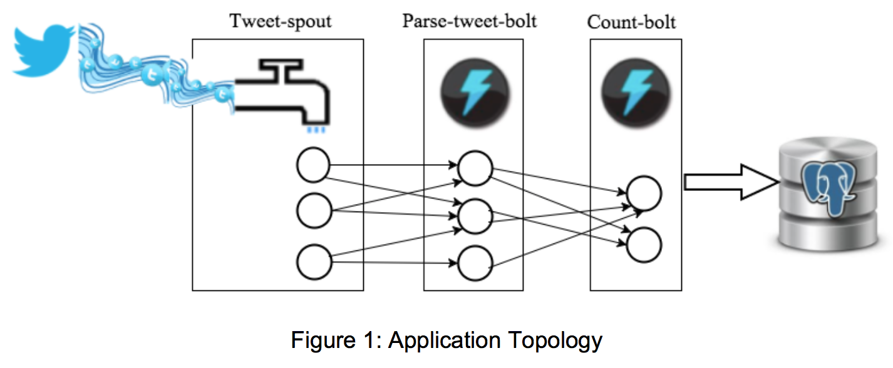
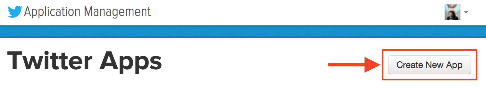
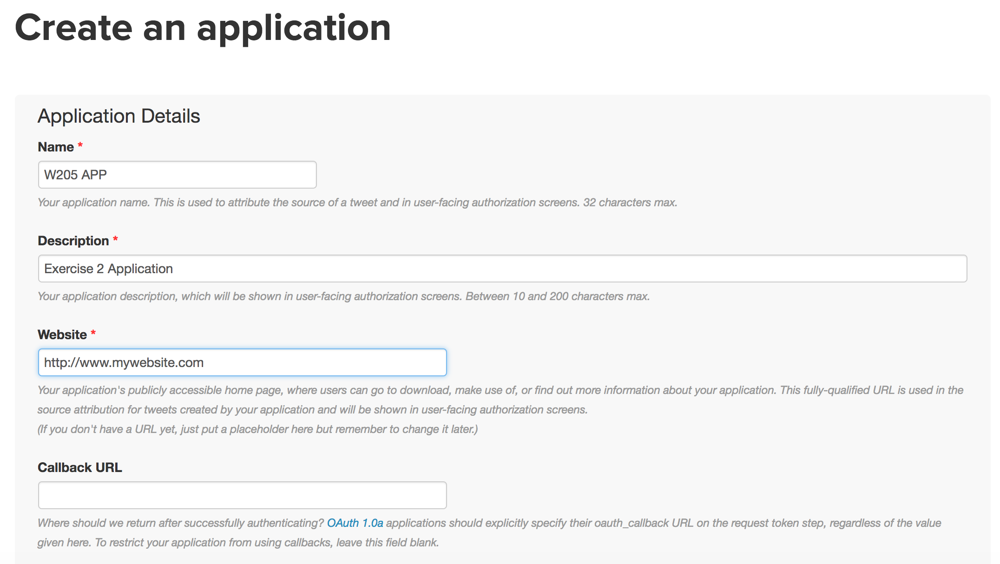
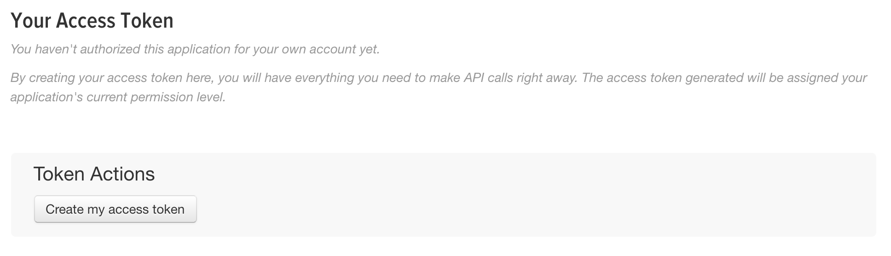
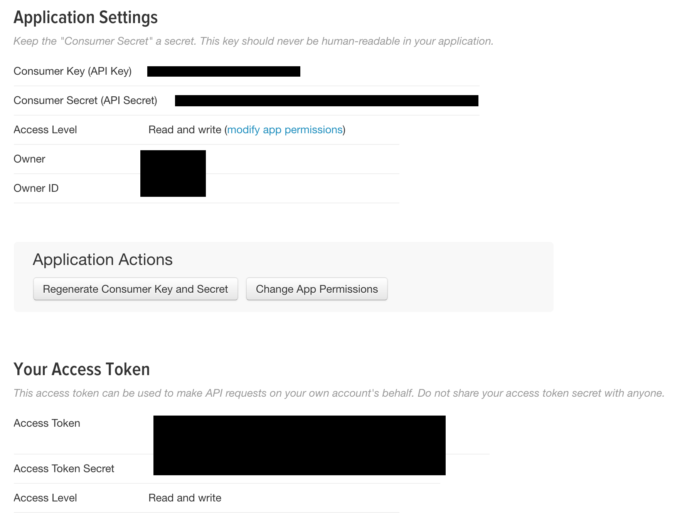

# MIDS W205: Exercise 2
|   |   |   |   |
|---|---|---|---|
| **Exercise #**      | 2   | **Title** | Introduction to the elements of a streaming application. |
| **Related Modules** | 8,9 | **Goal** | Implement an end to end streaming app. |
| **Last Updated** | 2/12/17 | **Expected Duration** | 10-15 hours |

## Introduction

Streaming applications may seem complex, but understanding how they operate is critical for a data scientist. In this exercise, we will explore a streaming application that analyzes Twitter data. In order to explore a complex implementation in a short period of time, you will develop your application using an existing codebase. You will use Streamparse, as seen in Lab 6, with a given topology. The application reads the stream of tweets from the Twitter streaming API, parses them, counts the occurrences of each word in the stream of tweets, and writes the final results back to a Postgres database.

## Scope & Goal

In this exercise, you will capture and process the live Twitter data stream, and learn the following tasks:

- How to capture the live data
- How to set up a stream processing pipeline
- How to process and get insights from streaming data
- How to store the final, processed results to a relational database management system.

## Technologies Used

Apache Storm, Amazon EC2, Python, Twitter API, Streamparse, Postgres, PsycoPG, Tweepy

## Instructions, Resources & Prerequisites

In the following table you will find reference resources related to the tools, libraries and programs used in this exercise.

| Resource | What |
|----------|------|
| [http://storm.apache.org/releases/current/index.html](http://storm.apache.org/releases/current/index.html) | Apache Storm Documentation |
| [https://streamparse.readthedocs.org/en/latest/api.html](https://streamparse.readthedocs.org/en/latest/api.html) | Streamparse Documentation |
| [https://dev.twitter.com/streaming/overview](https://dev.twitter.com/streaming/overview) | Twitter Stream API |
| [http://docs.tweepy.org/en/v3.5.0/](http://docs.tweepy.org/en/v3.5.0/) | Tweepy Documentation |
| [http://docs.tweepy.org/en/v3.5.0/streaming\_how\_to.html](http://docs.tweepy.org/en/v3.5.0/streaming_how_to.html) | Tweepy How-To |
| [http://initd.org/psycopg/](http://initd.org/psycopg/) | Psycopg Documentation |

**Note**: *You are going to use streamparse, and install psycopg. Do not use your primary saved instance image, from the previous labs or exercise. Instead, there is a new AMI specifically for Lab 6 and Exercise 2.*

## Use Case

Capturing and analyzing live twitter data around your business interest area can give you a deeper understanding of the current social trends and demands. Historical data can give you information on the mainstream trends over a certain period of time, but live data can provide immediate, real-time insight. For example, a person who manages the ads for a television station can capture  trends in real time during a live broadcast, to engage more viewers with contextual advertising.

In this exercise, you will capture live tweets, process them in real time to get insights, and aggregate the results in a database. Figure 1 shows the overall architecture of the application. Figure 1 also shows the Storm topology that you need to develop for the application. Using the Tweepy library, the application reads the live stream of tweets from Twitter in the **tweet-spout** component. The **parse-tweet-bolt** parses the tweets, extracts the words from each parsed tweet, and emits the words to the next bolt component (**count-bolt**) in the topology. The **count-bolt** counts the number of each word in the received tuples, and updates the counts associated with each word in the **tweetwordcount** table inside the **tcount** Postgres database.



## Overall Guidelines For All Steps

In this section, we provide the overall guidelines for implementing the system shown in Figure 1. Follow the below instructions for each step of your implementation. Be sure to use the **UCB MIDS W205 EX2-FULL** AMI for your EC2 instance, and store your application code in Github.

***Notes:*** *In order to run Postgres according to the instructions from previous labs, you will need to attach the /data EBS volume you have been using on the other AMI.*

## Step 1. Environment and Tool Setup

1. The code for this exercise can be found in the main course repository, which you can clone from git@github.com:UC-Berkeley-I-School/w205-spring-17-labs-exercises.git.
	* **Note**: *If you want to clone only the exercise_2 directory, see instructions in the appendix.*
2. Create an EC2 instance using the following AMI. Note that this is the same AMI used for lab 6.
	* **AMI Name: UCB MIDS W205 EX2-FULL**
	* **AMI ID: ami-d4dd4ec3**
	
	Also attach and mount the EBS volume at /data.
3. Install **psycopg** by running: `$ pip install psycopg2==2.6.2`
4. Create a project called **extweetwordcount** with Streamparse (see Lab 6 for details)
5. Copy the files from the **tweetwordcount** directory of the repository, and place them in the corresponding folders of the new **extweetwordcount** project. The description of the files in the code base is provided in Table 1.
6. Modify the **extweetwordcound.clj** to implement the topology in Figure 1.

**Note:** *Remember that leaving your EC2 server live while you are working will drain your AWS credit. Instead, save your work in github, then launch the server and pull the code when you are ready to test.*

#### Table 1: Description of the files in the codebase
| Name of the program | Location | Description |
|---------------------|----------|-------------|
| tweets.py | exercise_2/tweetwordcount/src/spouts/ | tweet-spout |
| parse.py | exercise_2/tweetwordcount/src/bolts/ | parse-tweet-bolt |
| wordcount.py | exercise_2/tweetwordcount/src/bolts | count-bolt |
| Twittercredentials.py | exercise_2/ | Twitter API Keys |
| hello-stream-twitter.py | exercise_2/ | Sample Twitter stream program |
| tweetwordcount.clj | /exercise_2/tweetwordcount/topologies/ | Topology for the application |
| psycopg-sample.py | exercise_2/ | Sample code for connecting to psycopg |

## Step 2. Twitter Application Setup

Once you have the topology configured, using the code from the cloned repository, modify the spout program (tweets.py) to pull the tweets from the Twitter streaming API. In order to get the tweets, you need to set up a Twitter application, and get access keys for pulling tweets out of the API.

### 2.1. Install Tweepy

The easiest way to install Tweepy is by using pip:

```
$ pip install tweepy
```

You may also use Git to clone directly from Github, and install it manually:

```
$ git clone https://github.com/tweepy/tweepy.git
$ cd tweepy
$ pythong setup.py install
```

The next step is to get access to Twitter data, by creating a Twitter application, and using the access keys provided in your program.

### 2.2. Create an Application

**Note:** *You will need to have a Twitter account to create an application.

1. Login to Twitter([https://www.twitter.com/](https://www.twitter.com/)).
2. Visit [https://apps.twitter.com/](https://apps.twitter.com/) and click on "Create New App".
	
3. Fill in the application name, description, and website (ignore the Callback URL field). The name will now be listed in as one of your applications.
	
4. Agree to the terms and agreements, and click "Create your Twitter Application"

Once you have successfully created an application, it should take you to the application page. Here you must create access keys for subsequent operations by your application, using the following procedure:

1. Click on the "Keys and Access Tokens" tab.
2. Click on "Create my access token" near the bottom of the page.



The reponse should be relatively immediate.



Now you have four pieces of information (from the blacked out fields above):

- A consumer key that identifies your application.
- A consumer secret that acts as a password for your application.
- An access token that identifies your authorized access.
- An access token secret that acts as a password for that authorized access.

At any point, you can revoke the access key, or regenerate any of these values. To completely disable the application, you must delete the application. This removes the consumer key, secret, and access tokens from Twitter's system, and any program using them will immediately stop working.

### 2.3. Test Your Application

In the code base that you cloned, `hello-stream-twitter.py` is a sample application that pulls tweets from the Twitter streaming API. This program uses Tweepy to interact with the API, and you can use it to test your credentials. Change the code in `Twittercredentials.py` and insert your consumer key, consumer secret, access token, and access token secret. You should then be able to run the program, and get tweets:

```
$ python hello-stream-twitter.py
```

## Step 3. Application Deployment

Now that you have a Streamparse project and a Twitter application, your task is to write the code that connects all the necessary pieces together, to create a full stream tweet word count processing application, as depicted in Figure 1. Your application has the following pieces, which will need to be modified to complete the exercise:

1. A spout connected to the Twitter streaming API, that pulls tweets and emits them to the parse bolt.
2. A parse-tweet-bolt, that parses the tweets emitted by the spout, and extracts individual words out of the received tweet text.
3. A Postgres database called **tcount**, with a table called **tweetwordcount**.
3. A count-bolt, that counts the number of words emitted by the tweet-parse bolt, and updates the total counts for each word in the Postgres table. Modify the code in wordcount.py so that it updates the table. You can find sample code on how to use the **psycopg** library to interact with Postgres in psycopg-sample.py.file.

## Step 4. Serving Scripts

In this step, your task is to develop two simple scripts that query the database, and return specific results as follows:

### finalresults.py

When passed a single word as an argument, finalresults.py returns the total number of word occurrences in the stream. For example:

```
$ python finalresults.py hello
Total number of occurrences of of "hello": 10
```

Running finalresults.py without an argument returns all the words in the stream, and their total count of occurrences, worted alphabetically, one word per line. For example:

```
$ python finalresults.py
$ (<word1>, 2), (<word2>, 8), (<word3>, 6), (<word4>, 1), ...
```

### histogram.py

The script gets two integers k1,k2 and returns all the words with a total number of occurrences greater than or equal to k1, and less than or equal to k2. For example:

```
$ python histogram.py 3,8
<word2>: 8
<word3>: 6
<word1>: 3
```

## Submission Instructions

### General guidelines:

1. All code outlined above **must be** committed and pushed to your GitHub repository.
2. All code must be runnable by your instructor in the **UCB MIDS W205 EX2-FULL**.
3. Your GitHub repository **must be** shared with your section instructor, via pull request

**Note:** *Please invite your instructor to collaborate on the repository in advance of the due date, so you don't risk being unable to initiate a pull request at turn-in time.*

### Deliverables

Your GitHub respository should include:

1. Complete and fully functional application code, based on the description above.
2. `Architecture.pdf`: complete documentation (max 4 pages) of your Twitter application, including directory and file structure, application idea, description of the architecture, file dependencies, any necessary information to run the application, etc.
3. A directory called `screenshots/` that has at least three screenshots, of your choice, demonstrating an end-to-end execution of your application. (Please name screenshots consistently, e.g.: `screenshot-twitterStream.png`, `screenshot-stormComponents.png`, `screenshot-extractResults.png`.)
4. `Readme.txt`: a file that shows the step-by-step instructions on how to run the application.
5. `Plot.png`: a bar chart, generated however you prefer, that shows the top 20 words in your Twitter stream.

## Appendix

In this section we introduce some optional instructions, and provide the grading rubric for this exercise.

### Cloning a subdirectory

Git clones a complete repository. If you want only to clone the `exercise_2/` directory you can use "sparse checkout." Follow the below instructions to clone only `exercise_2/`:

```
$ mkdir ex2
$ cd ex2/
$ git init
$ git remote add -f origin git@github.com:UC-Berkeley-I-School/w205-spring-17-labs-exercises.git
$ git config core.sparseCheckout true
$ echo "exercise_2" >> .git/info/sparse-checkout
$ git pull origin master
```

### Exercise 2 Grading Guidelines:

| Aspect | Description | Grading |
|--------|-------------|---------|
| Functionality | Complete and fully functional spout and bolts, based on the description. | <ul><li>Correct and executable spout: 25 points</li><li>Correct and executable bolts: 30 points</li><li>Correct topology: 5 points</li><li>Correct results from Finalresults.py</li><li>Correct results from Histogram.py: 10 points</li><li>**Max: 80 points**</li></ul> |
| Design/Architecture | Complete documentation of the system | <ul><li>Correct project, folder, file, database and table names: 3 points</li><li>Description/Execution instructions (readme.txt): 3 points</li><li>Complete application documentation (Architecture.pdf): 10 points</li><li>Screenshots: 2 points</li><li>Plot.png: 2 points</li><li>**Max: 20 points**</li></ul> |
