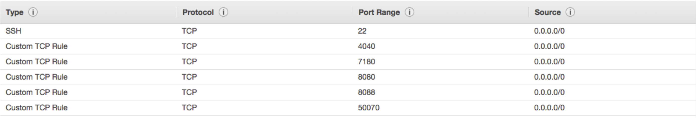
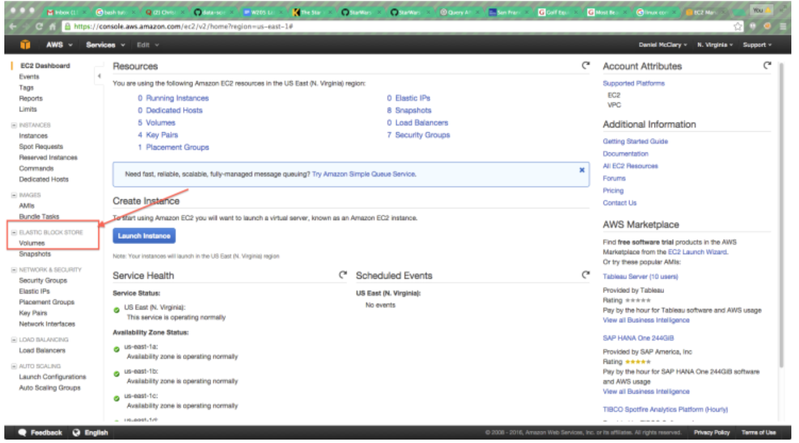
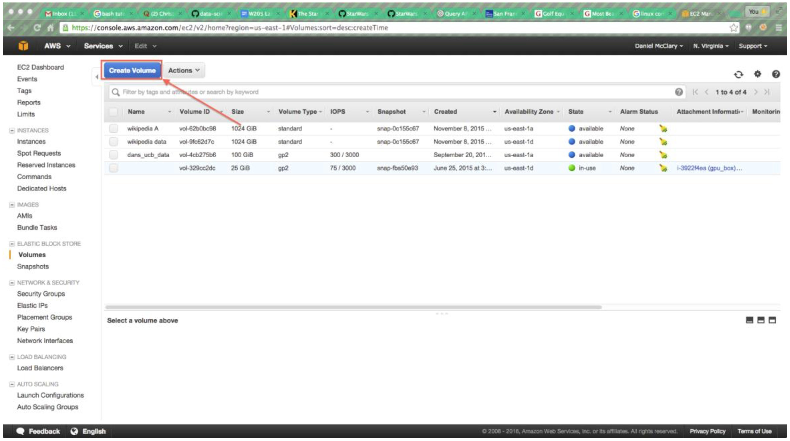

#MIDS W205 : Lab 2

|                      |        |                     |                                                  |
|----------------------|--------|---------------------|--------------------------------------------------|
| *Lab*                | 2      | *Lab Title*         | Setting Up Pseudo-Distributed Hadoop on AWS |
| *Related Modules(s)* | 1-4      | *Goal*              | Understanding architecture concepts |
| *Last Updated*       | 1/7/17 | *Expected Duration* |  40-60 minutes         

##Introduction:

In this introductory lab we will be setting up a persistent volume on which to store our work
during the course. We will create both a simple filesystem and a distributed filesystem, and
explore each of them. In this lab, we will learn about the following:

- How to create an EBS volume
- How to mount an EBS volume on a running EC2 instance
- How to create directories and files on an EXT4 filesystem
- How to create directories and files on the Hadoop Distributed Filesystem

Most of the detailed configuration work is taken care of for you. However, it is useful to refer to the AWS documentation for understanding EBS, as well as the Apache Hadoop information to better understand HDFS. In the below table you can find links to useful and necessary resources discussed in this lab.

| **Resource** | **What**|
|---|---|
|[http://docs.aws.amazon.com/AWSEC2/latest/UserGuide/AmazonEBS.html](http://docs.aws.amazon.com/AWSEC2/latest/UserGuide/AmazonEBS.html) | Amazon Elastic Block Store (Amazon EBS) |
| [http://hadoop.apache.org/docs/current/hadoop-project-dist/hadoop-hdfs/HdfsUserGuide.html](http://hadoop.apache.org/docs/current/hadoop-project-dist/hadoop-hdfs/HdfsUserGuide.html) | HDFS Users' Guide |

##Step-1. Start Your EC2 Instance and Create an EBS Volume

We're going to begin by making a persistent disk that we can attach to EC2 instances. This will give us a common place to put data and programs over the term. To do this:

1. Launch an instance of UCB W205 Spring 2016, **make note of what zone it is placed into**

  a. You will need to use an instance with at least 4 GiB of memory since Postgres and Hadoop use more memeory than is avaliable on smaller instances.
  
  b. If the instance starts in US-East-1A, that is where we need an EBS volume. If it starts in US-East-1B, then the EBS volume will need to be created there.

  c. **Important:** Once you decide what zone you will create your EBS volume in, **ALWAYS** launch your EC2 instances into that zone.

  d. Before launching your instance, you need to modify the security rules. This will allow you to access the Hadoop and Spark web interfaces.

    - Create the following open TCP ports on `0.0.0.0/0`  (all ip addresses, in practice you will want to limit this to as neccessary)

          1. 22 (SSH)
          2. 4040 (Spark-ui)
          3. 7180 (Cloudera Manager)
          4. 8080 (Webserver)
          5. 8088 (Jupyter Notebook)
          6. 10000 (Hive)
          7. 50070 (Hadoop)
 
    - Before you launch your instance, check to make sure your security group looks like the following

    - Name the security group "Hadoop Cluster UCB"
 
    - Finish launching the instance
    
  

2. Click through to the Elastic Block Store Page shown below

 

3. Choose "Create Volume" as shown below

  a. Make certain that the volume is in the same zone as your Instance
 
  b. Create at volume of at least 30GB. 100GB or more is recommended for the course.

    

4. Check the box next to your new volume. From the Actions menu, choose "Attach Volume" and attach the volume to your running instance.

##Step-2. Log into your EC2 Instance and Determine Device Information

Once your instance is launched and your EBS volume is attached, you'll need to log into it via SSH. Once you are logged in, type whoami and make sure you are the root user. We now need to determine where our EBS volume has been attached. Right now, our EBS volume isn't a filesystem yet, it's only a device. We'll need to know what device it is in order to make a 
filesystem.

At the prompt, type `fdisk -l` You should see a reading like this. (fdisk means fixed disk and the -l flag tells it to return a list)

  ```
  Disk /dev/xvdb: 32.2 GB, 32204390400 bytes
  255 heads, 63 sectors/track, 3915 cylinders
  Units = cylinders of 16065 * 512 = 8225280 bytes
  Sector size (logical/physical): 512 bytes / 512 bytes
  I/O size (minimum/optimal): 512 bytes / 512 bytes
  Disk identifier: 0x00000000
  
  Disk /dev/xvdf: 107.4 GB, 107374182400 bytes
  255 heads, 63 sectors/track, 13054 cylinders
  Units = cylinders of 16065 * 512 = 8225280 bytes
  Sector size (logical/physical): 512 bytes / 512 bytes
  I/O size (minimum/optimal): 512 bytes / 512 bytes
  Disk identifier: 0x00000000
  ```

Look for the disk path that has a size matching the EBS volume you created. Note that your EBS
volume is rarely at `/dev/xvdb`, as that is default storage provided to the instance by Amazon. In
the case of the example above, the disk is device `/dev/xvdf`. Make a note of this device path
for the next step.

##Step-3. Download and Run the Setup Script

The process of creating a filesystem, mounting it, formatting it for HDFS, setting up PostgreSQL and the host of other tasks necessary to create the UCB W205 environment can be very time consuming. As such, we have created a setup script designed to simplify the process. You are **strongly encouraged** to read the setup script and think about what processes are taking place. A good exercise would be to write comments for the script while reading it and discussing with classmates. However, for the purpose of the lab, you can simply follow the instructions below.

1. Make a directory at the top level called /data
  a. Type: `ls /`
    
    i. Notice the "data" directory. This is where we will mount the disk.
    
    ii. We will always try to work out of `/data` in order to preserve data between
    sessions.
  
  b. Type: `chmod a+rwx /data`
    
    i. This sets `/data` as readable, writable and executable by all users. It is insecure, but it will eliminate permissions problems.

2. Download the setup script

  a. Type: `wget https://s3.amazonaws.com/ucbdatasciencew205/setup_ucb_complete_plus_postgres.sh`

  b. Type: `chmod +x ./setup_ucb_complete_plus_postgres.sh`

3. Run the setup script

  a. Type: `./setup_ucb_complete_plus_postgres.sh <*the device path from step 2*>`

  b. Hit Enter

4. When the script completes, the following components will be set up:

  a. The Hadoop Distributed File System (HDFS)

  b. Apache Hadoop YARN

  c. Apache Hive

  d. PostgreSQL

##Step-4. Interact With the Hadoop Distributed File System

For the final part of the lab, we'll begin to interact with HDFS, the Hadoop Distributed Filesystem. We're going to place a file in HDFS, then examine it's characteristics. First, we're going to change from the root user to the w205 user. It is generally bad practice to work as the root user, unless you're configuring or installing things. In the future, try to do most of your work as the w205 user.

1. Change to the w205 user. Type: `su - w205`
  
  a. Find out if you changed users. Type `whoami`
  
2. Find out where you are. Type: `pwd`

  a. You should be in `/home/w205`

3. List the contents of the directory. Type: `ls -alF`

  a. You will notice a small file called `derby.log`

We interact with HDFS the same way we interact with a Linux filesystem, but via the hdfs program.

1. List the directories in HDFS under `/user`. Type: `hdfs dfs -ls /user`

  a. You should see a directory called `/user/w205` (notice that this doesn't exist on your AMI instance's file system)

2. Place the `derby.log` file into HDFS. Type: `hdfs dfs -put derby.log /user/w205`

3. List the contents of `/user/w205`. Type: `hdfs dfs -ls /user/w205`

  a. Check that the `derby.log` file is present

We can also view the state of HDFS via a web interface. Do this by going navigating in your
web browser to: `http://<your ec2 hostname>:50070` (*This may not work behind certain firewalls*).

##Step-5. Safe Shutdown

Once your submission is complete, you'll want to shutdown HDFS, Hadoop and PostgreSQL gracefully. As the root user, do the following:

1. Type: `/root/stop-hadoop.sh`
2. Type: `/data/stop_postgres.sh`
3. You may now safely shutdown the instance.

##Submissions:

1. List the HDFS contents of `/user`

2. Inspect the output of the HDFS admin report and answer the following questions in a text file.

  -To generate this, exit from the w205 user and type: `sudo -u hdfs hdfs dfsadmin -report`

Q1: How many live datanodes are there?
  
Q2: How much non-DFS storage is used?
 
Q3: How much DFS storage is used?
