# MIDS W205 : Lab 7      
|                      |        |                     |                                                  |
|----------------------|--------|---------------------|--------------------------------------------------|
| *Lab*                | 7      | *Lab Title*         | Introduction to Using Tableau With Hive          |
| *Related Modules(s)* | 8      | *Goal*              | Introduction to Using Tableau With Hive          |
| *Last Updated*       | 3/2/17 | *Expected Duration* | 30-80 minutes                                    |


## DISCLAIMER
Our labs and exercises are tested on AMI's provided for the course. We test labs on other platforms such as MacOS on a best effort basis only. If you run on other platforms such as MacOS it is your responsibility to determine environmental issues such as installs of non-standard tools etc. We will be helping out with environmental issues as time permits.


## Introduction

Tableau is one of the world’s fastest-growing business intelligence companies. Tableau offers to quickly analyze, visualize, and share information. As with most BI tools, Tableau can use Apache Hive (via ODBC connection) as the de facto standard for SQL access in Hadoop.

We will cover the following topics in this lab:
 1. Creating a Hive table and running a sample query on Hive
 2. Installing Tableau and ODBC driver for connecting to Hive
 3. Configuring and connecting to Hadoop Hive from Tableau using ODBC driver
 4. Build visualization on Weblog Clickstream Analytics using Tableau


## Step 0: Running the Required Services

The following steps launch the required services and prepare your instance for the next steps.

1. Make sure port 10000 is open on your instance. To do this, edit your instance security group and add a TCP port 10000 accessible from anywhere in the Inbound section.

2. SSH to your instance and do not forget to mount /data (see lab 2, steps 2-3 if you need a reminder).

3. `cd /data`

4. StartHadoop: `./start_hadoop.sh`

5. Start Postgres for hive meta data: `./start_postgres.sh`

6. Start Hive Metastore: 
    sudo -u w205 
    /data/start_metastore.sh
    

## Step 1: Creating Hive Table and Running a Sample Query on Hive
    
Switch to user w205.

    su - w205
   
You likely have the weblog data set from lab 4.  If not, you can re-dowload it with 

    cd 
    git clone https://github.com/UC-Berkeley-I-School/w205-spring-17-labs-exercises.git

Open hive:
    
    hive
    
The following code creates a table—Web_Session_Log—from the weblog data introduced in previous labs. While this lab uses Tableau to explore the weblog data, feel free to proceed with any table you want.

    CREATE TABLE Web_Session_Log(
         DATETIME varchar(500), USERID varchar(500),
         SESSIONID varchar(500),PRODUCTID varchar(500),
         REFERERURL varchar(500)
    )
    ROW FORMAT DELIMITED FIELDS TERMINATED BY "\t"
    STORED AS textfile
    tblproperties("skip.header.line.count"="1");
    
Load Data into the Table:

From HDFS:

    LOAD DATA INFILE 'hdfs:///mnt/weblog/weblog.csv'
    INTO TABLE Web_Session_Log;
    
From Local File System:

    LOAD DATA LOCAL INPATH '/home/w205/w205-spring-17-labs-exercises/data/weblog_lab.csv'
    INTO TABLE Web_Session_Log;
    
Sample Hive Query
This is a query to find out which REFERERURL has been referred and for how many times.

    SELECT REFERERURL, count(*)
    FROM Web_Session_Log
    GROUP BY REFERERURL;

## Step 2: Starting a Hive Thrift Server for Remote Hive Access

**HiveServer2** is a server interface that allows remote clients to execute queries against Hive. In Tableau, we will be able to extract data from our Web_Session_Log table by sending requests through HiveServer2.
How to start:
    
    hive --service hiveserver2 &
    << wait for the startup messages to finish and then hit the enter key to get the command prompt back >>
    
There is an older hiveserver, but it is not recommended and the latest version of the Cloudera ODBC drive does not seem to support it. 
(Note that as of Hive 1.0.0, HiveServer was removed in favor of HiveServer2. It is recommended you use HiveServer2.)
Here are the older commmands:

    hive --service hiveserver –help
    hive --service hiveserver

Tableau uses ODBC and does not use JDBC. In case you want to use other software products which use JDBC, here are JDBC connection strings for your reference:

with username and password:

    jdbc:hive2://myhost.example.com:10000/test_db;user=fred;password=xyz123

without username and password:

    jdbc:hive2://ec2-54-157-182-212.compute-1.amazonaws.com:10000/default


## Step 3: Installing Tableau and ODBC Driver for Connecting to Hive

As you recall from previous labs, Hive is a data warehouse technology for working with data in your Hadoop cluster using a combination of traditional SQL expressions and advanced Hadoop-specific data analysis and transformation operations. Tableau works with Hadoop using Hive to provide a user experience that requires no programming.

In this lab, we will connect Tableau Desktop Pro with the HiveServer in order to access the Hive table `Web_Session_Log`, which we created earlier.

To install Tableau on your desktop (Tableau Desktop Pro Edition):
You can download Tableau Desktop Pro directly from Tableau’s website. Select the Windows or Mac version based on your operating system (32-bit or 64-bit).  At the time of this writing students get a free liscence for a year for educational work (https://www.tableau.com/academic/students).

Once the product is downloaded, you can install it by double-clicking the installer package.
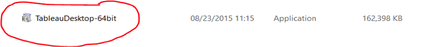

To install the ODBC driver for Hive (onto your local machine, where Tableau is):
For both HiveServer and HiveServer2, you must install the Cloudera, Hortonworks, MapR, or Amazon EMR ODBC driver from the Drivers page. Ensure that the version of the driver you download matches the bit version of your operating system.  Think back to Lab 1 to figure out which hadoop distribution or hive version `yum` (hint) has installed.  

● Cloudera (Hive): Cloudera ODBC Driver for Apache Hive 2.5.x, 32-bit or 64-bit
o For use with Tableau Server 8.0.0–8.0.7; for 8.1.0–8.1.3, use version 2.5.0.1000. o For use with Tableau Server 8.0.8 and later; for 8.1.4 and later, use driver version
2.5.0.1001 or later.
o Cloudera drivers can be found here.

● Hortonworks: Hortonworks Hive ODBC Driver 1.2.x (32-bit or 64-bit)

● MapR: MapR_odbc_2.1.0_x86.exe or later, or MapR_odbc_2.1.0_x64.exe or later

● Amazon EMR: HiveODBC.zip or ImpalaODBC.zip
Note: If you have a different version of the driver installed, uninstall that driver before installing the version provided on the Cloudera website.
    

## Step 4: Configuring and Connecting to Hadoop Hive From Tableau Using ODBC Driver (Windows Only)

After installing the appropriate ODBC driver, you need to configure the ODBC System DSN on Windows. Download the driver for the appropriate version of Tableau Desktop (x86 or x64), and install it. Go to `Control Panel -> System & Security -> Administrative Tools -> ODBC Data sources (32-bit or 64-bit)`.
Open the ODBC data source, go to the System DSN tab, and configure it by applying `Host` (Hadoop server name), `Port` (10000), `Database` (default), `HiveServer Type` (HiveServer2), and the authentication panel, then enter the username and password credentials (if you configured security settings on server authentication).

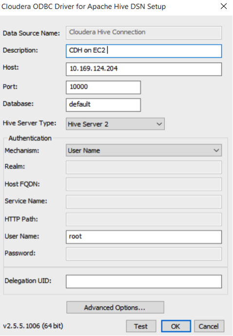

Click **Test** to check the connectivity of Tableau to the Hadoop server. If the connection is successful, a success message is displayed. Otherwise, an error message is displayed.

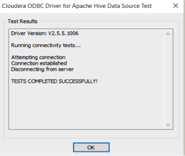

#  An optional, alternate, way to test the Hiveserver2 is running. 
Launch another terminal connection to your EC2 instance.  No need to mount a drive or start the servers because they should be started already. 

    /usr/lib/hive/bin/beeline
When a beeline prompt comes up:

    !connect jdbc:hive2://localhost:10000 
    SHOW TABLES;
    
You should get a with at least `least web_session_log` that looks like this:
```
+------------------+--+
|     tab_name     |
+------------------+--+
| user_info        |
| web_session_log  |
| weblogs_flat     |
| weblogs_parquet  |
| weblogs_schema   |
+------------------+--+
```

## Step 5: Connect Tableau to HiveServer/HiveServer2 Using ODBC Driver

Open Tableau Desktop Pro from its quick-launch option.


Next, go to `Data -> New Data Source` tab, and click **Cloudera Hadoop** to connect to the Hadoop server.

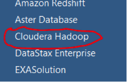

The Cloudera Hadoop connection pane opens. Enter the Hadoop server credentials to connect. To connect to the HiveServer, the default port number should be 10000, the Type should be HiveServer2, and the username needs to be provided.  The username may be *root* or *w205* depending on which user launched the hiveserver2.

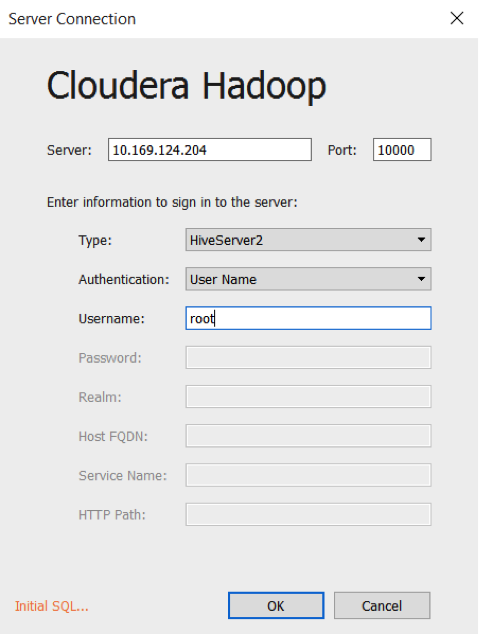

## Step 6: Build Visualizations on Weblog, Clickstream Analytics Using Tableau

After the data source connection is made successfully, you can connect to the Hive table. Click **Extract** to store the schema in local memory. Switch back to Tableau. Under the Data Connection pane, enter the schema name, enter **default**, and click the **Search** icon on the right side of the textbox. Next, enter the table name `Web_Session_Log` in the Table name textbox, click the **Search** icon on the right side of the textbox, and select and drag the table to the upper-right side of the Tableau window, as shown in the following screenshot.

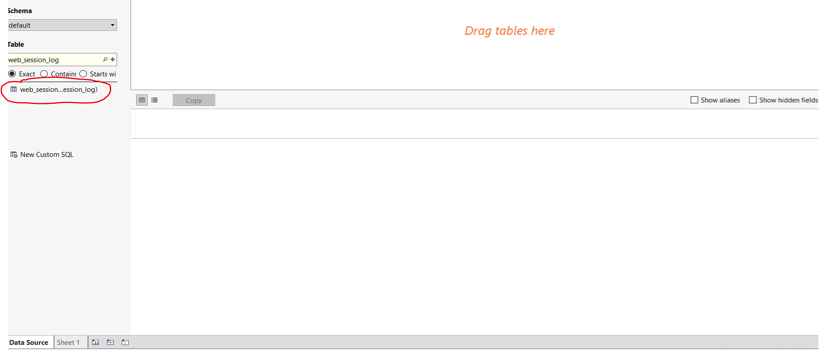

Click **Extract** to extract the data locally on an in-memory Tableau dataset to avoid unnecessary server latency.  *In the future, beware of very large hive tables if your data does not fit in your desktop's memory.* 

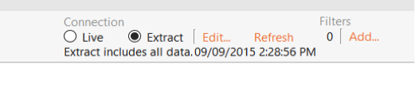

Click `Automatic update` to refresh the dataset. It should look like the following screen:

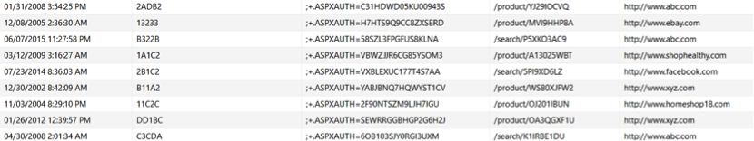

Tableau automatically creates your first worksheet named `Sheet 1`. Click on `Sheet 1` to start building visualizations.  If you chose to extract your data in the previous step, Tableau will prompt you to save it into a .tde (Tableau Data Extract) file.  This is recommended to keep your data separate from code.  Also, if you choose to upload your data visualizations to the Tableau Public server, you will need to have data stored in this format for the upload to work correctly.

Note: if you are only using 1 table, Tableau 10 does **not** show the table name in \<table_name\>.\<column_name\> as previous versions displayed.

On the new worksheet tab, on the `Data` pane, drag the `web_session_log.sessionid` field to the `Measures` pane.

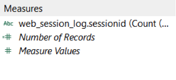

Next, drag the field to the `Rows` shelf. Hover over the field to expand the drop-down menu. Change the aggregation method (under `Measure`) from `Sum` to `Count (Distinct)`.
Note: Tableau 10 seems to correctly change the aggregation method for you, unlike previous versions.

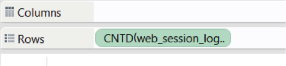
   
Drag the `web_session_log.refererurl` field to the `Column` shelf, then right-click the value to create a filter to visualize the top five referring URLs. Select `Filter`, and click the `Condition` tab to get URLs based on `web_session_log.sessionids` beyond a certain value (e.g. `web_session_log.sessionid >= 3,996`) to drill down to the top five referring URLs.

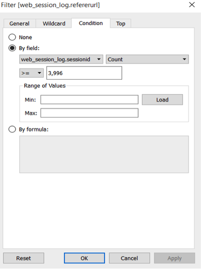

After you define the settings, change the chart type in the `Show Me` pane on the right side of the window.

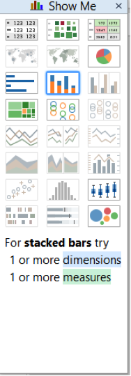

Select the bubbles chart type. You will see the graph, “Top 5 Referring URLs,” as follows:

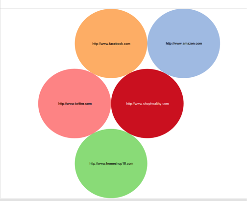

Next, create a new worksheet and name it **Top Referring URLs over last 10 years**. Drag `web_session_log.sessionid` to the `Rows` shelf.
On the `Data` pane, right-click on the datetime field, and change its data type to Date and Time. Then, drag it to the `Columns` shelf. Drag the `Referer URL` field to the `Color` section of the `Marks` pane. In the Show Me section, select the lines chart type.

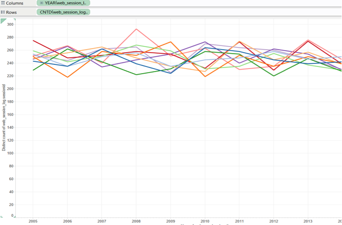

Go to a new worksheet tab, and name it **Top 10 users who used top 10 products**. On this worksheet tab, drag the sessionid field to the Rows shelf and the `userid` field to the Columns shelf. Filter the users based on the maximum session count. You need to filter the userid data based on condition of the `sessionid` value. Drag the `productID` field to the color field in the Marks pane to differentiate between products. You may select the simple stacked-bar chart type.
Note: depending on the data set, it may be possible that there is not a "top 10 products".  Check your data, if necessary, using SQL in Hive to verify if it seems this is the case.

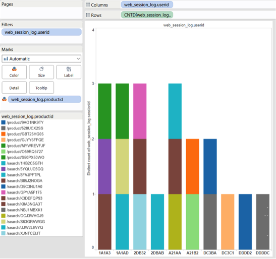

Once, you build such few graphs, click the Dashboard tab on top of the Tableau window

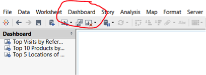

Select **New Dashboard** to start implementing the **weblog-clickstream** analytics dashboard. On the new dashboard page, drag the existing implemented worksheet graphs to the right pane.

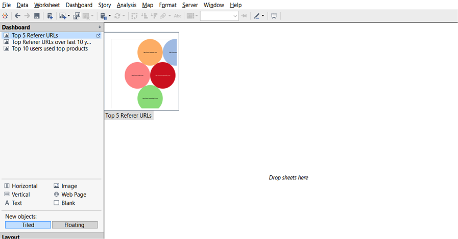

When you drag and drop the implemented graphs on the exiting worksheet, you will see the Weblog Clickstream analytics dashboard on Tableau Desktop, as shown in the following screenshot:

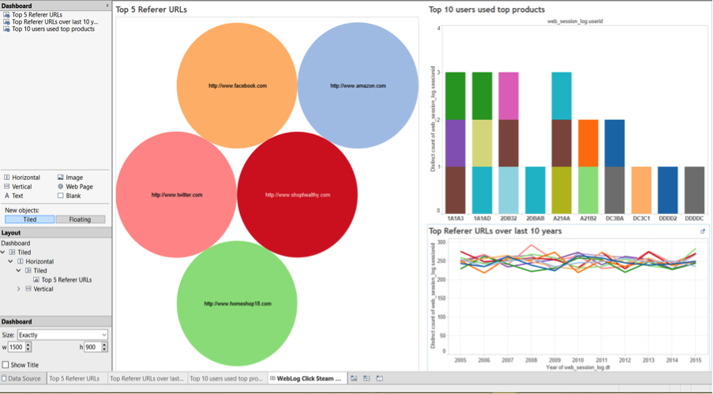

You can also publish the workbook on Tableau Server if you have those credentials. Always save the workbook on your local drive using the `File -> Export` as Packaged workbook option. You can also print the entire workbook or selected worksheets in PDF format as required.

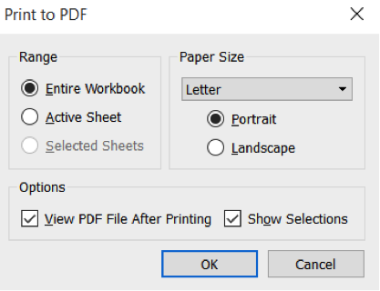

The Tableau ***weblog-hive-clickstream analytics workbook*** is printed in PDF format.

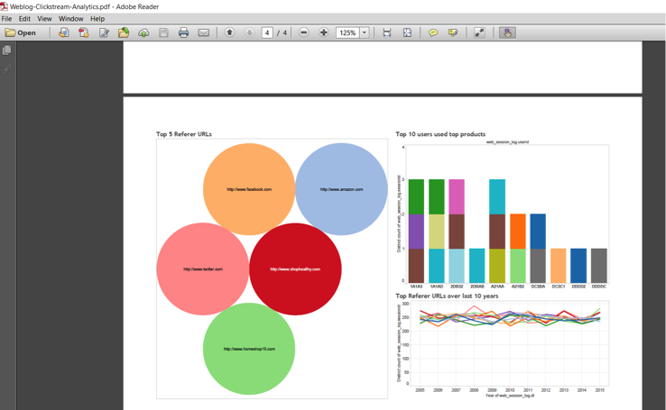

Task: Submit the printed PDF ***weblog-hive-clickstream analytics*** workbook.
