# MIDS W205: Lab 8

|                      |         |                     |                                                  |
|----------------------|---------|---------------------|--------------------------------------------------|
| *Lab*                | 8       | *Lab Title*         | OpenRefine—Introduction                          |
| *Related Modules(s)* | 7       | *Goal*              | Get you started on OpenRefine and edit distance  |
| *Last Updated*       | 1/28/17 | *Expected Duration* | 60 minutes                                       |

## Introduction

This lab has three parts. The first two infolve using OpenRefine to clean up some data files. The third involves calculating the Levenshtein distance between two strings.

OpenRefine is an open source tool for working with messy data. In this lab we will give you a quick tour of how you can use it to clean data. This is a deliberately short introduction to acquaint you with the basics of the tool. More comprehensive tutorials can be found linked from the resources section.

For the OpenRefine portion we will be using two datasets. You can access the datasets from Github (both are available if you clone or pull), or use the links in the text below.

The first dataset contains customer complaints; you can download that dataset [here](https://github.com/UC-Berkeley-I-School/w205-labs-exercises/blob/master/lab_10/dataset/Consumer_Complaints.csv).

The second dataset is the eq2015 dataset, which contains information about earthquakes of magnitude 3 or higher during the first six months of 2015. You can download the earthquake dataset [here](https://github.com/UC-Berkeley-I-School/w205-labs-exercises/blob/master/lab_10/dataset/eq2015.csv). You can find an earthquake data attribute glossary [here](http://earthquake.usgs.gov/earthquakes/feed/v1.0/csv.php).

OpenRefine is largely menu and GUI driven, but it also incorporates a domain-specific language for doing certain types of transformations.

## OpenRefine

OpenRefine is centered around the exploration of data in terms of patterns, called facets. Facets help by characterizing data, and provide an overview of value ranges, missing values, and so on. There are a number of facets for different data types, as well as plots, such as scatter plots. Once you understand the data, you can manipulate it using pattern matching and transformations. In OpenRefine, these transformations can be expressed in the General Refine Expression Language (GREL), although there are GUI-based methods as well.

As an example, you can create a new column based on an existing column, with a transformation applied to the data. GREL allows you to match regular expressions, and perform common operations like trimming blanks, splitting strings, and so forth. In addition, it has control structures, such as if statements. You can even have OpenRefine call out to URLs and insert the results into a column. OpenRefine also supports fuzzy matching (clustering) of attribute values. It will suggest values to merge, and will let you choose which to use. You can adjust the way clustering works, using parameters such as radius and character-block matching.

## Instructions, Resources, and Prerequisites

For Step 1 and Step 2, install OpenRefine from [here](http://openrefine.org/). The lab describes a number of commands to try, and also poses a few questions to consider and experiment with. For the assignment, answer the SUBMISSION questions embedded throughout this lab.

For Step 3, make sure you have a working Python installation.

Below are a number of resources that may be of general interest to you, during or after the lab.

| Resource | What |
|----------|------|
| [http://openrefine.org](http://openrefine.org) | This is where you download OpenRefine. |
| [http://arcadiafalcone.net/GoogleRefineCheatSheets.pdf](http://arcadiafalcone.net/GoogleRefineCheatSheets.pdf) | A short description of OpenRefine commands. |
| [http://enipedia.tudelft.nl/wiki/OpenRefine_Tutorial](http://enipedia.tudelft.nl/wiki/OpenRefine_Tutorial) | Another tutorial on OpenRefine. |
| [https://github.com/OpenRefine/OpenRefine/wiki/General-Refine-Expression-Language](https://github.com/OpenRefine/OpenRefine/wiki/General-Refine-Expression-Language) | GREL is the language used in OpenRefine for data refinements. This is a reference guide for the GREL language. |
| [https://pypi.python.org/pypi/python-Levenshtein/0.12.0](https://pypi.python.org/pypi/python-Levenshtein/0.12.0) | A Levenshtein module you can use to check your results in a Python shell. |
| [https://github.com/OpenRefine/OpenRefine/wiki/Clustering-In-Depth](https://github.com/OpenRefine/OpenRefine/wiki/Clustering-In-Depth) | A good, quick read on some clustering methods. |
| [https://github.com/UC-Berkeley-I-School/w205-labs-exercises/blob/master/lab_10/dataset/eq2015.csv](https://github.com/UC-Berkeley-I-School/w205-labs-exercises/blob/master/lab_10/dataset/eq2015.csv) | Earth Quake Data set |
| [http://earthquake.usgs.gov/earthquakes/feed/v1.0/csv.php](http://earthquake.usgs.gov/earthquakes/feed/v1.0/csv.php) | Earthquake Data Glossary. |
| [https://github.com/UC-Berkeley-I-School/w205-labs-exercises/blob/master/lab\_10/dataset/Consumer_Complaints.csv](https://github.com/UC-Berkeley-I-School/w205-labs-exercises/blob/master/lab\_10/dataset/Consumer_Complaints.csv) | Customer Complaints Data. |

## Step 1. Wrangling the Customer Complaints Data

### Uploading data

After you start OpenRefine, you can pick a dataset. For this first step, choose the [Customer Complaints dataset](https://github.com/UC-Berkeley-I-School/w205-labs-exercises/blob/master/lab\_10/dataset/Consumer_Complaints.csv); dataset/Consumer_Complaints.csv in the course repository folder for this lab.

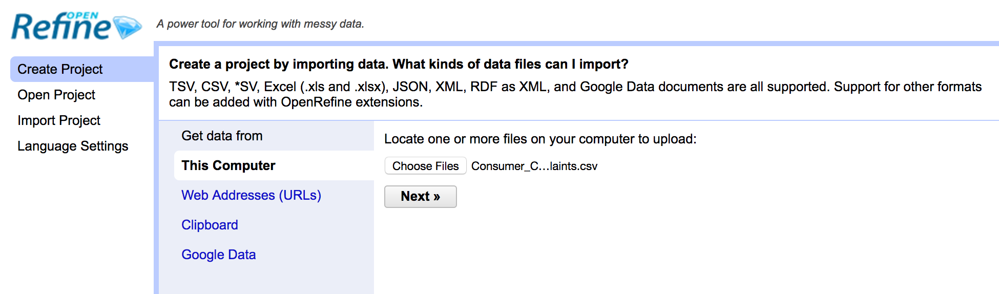

After the data are read, you can inspect them. In this case they look OK. However, if they had been tab separated rather than comma separated, OpenRefine would not have identified the structure correctly.

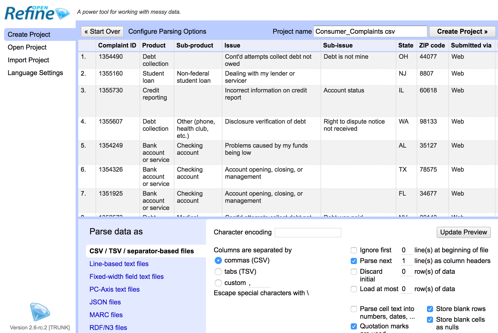

Note that we specified that the first line should be parsed as column headers.

### Creating a project

Because we think the data look good, we will now click **Create Project**. Creating the project can take a little time, because there are more than 300,000 lines in this file.

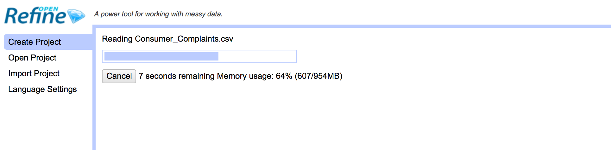

Once the project is created, you can see that it has 384,498 rows.

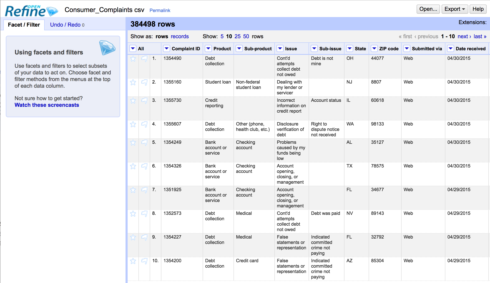

### Check states with text facet

If you select text facet for the State attribute, you will see a summary in the left pane, indicating that we have 62 different state values. Try and figure out why.

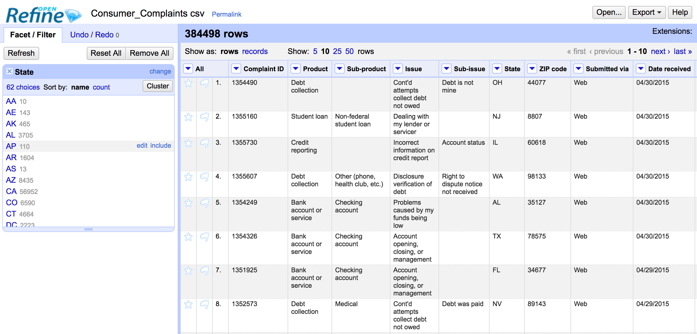

---

**Submission 1**

*How many rows are missing a value in the "State" column? Explain how you came up with the number.*

---

### Checking ZIP codes

Try the text facet on "ZIP code." What happens? You can see that there are 24,748 different ZIP codes in this dataset. Is that reasonable? Eyeball the data—do all ZIP codes look valid? You may need to research valid ZIP codes on the internet to determine if the values are reasonable.

Now try the numeric facet. OpenRefine attempts to treat the ZIP codes as numeric value. Based on the output you see, what would you say the scalar type is for ZIP codes? How can it be transformed to behave as a numeric attribute?

Once it has numeric values to work with, the facet should show a histogram of the available values.

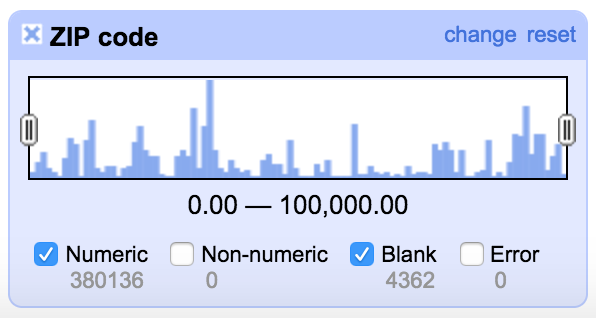

---

**SUBMISSION 2:**

*How many rows with missing ZIP codes do you have?*

---

One way of filling in missing values is to take the previous value, and use that to set subsequent empty cells. In OpenRefine, this is called fill down. Find a row with a blank ZIP code value. Apply fill down to the column using: `Edit Cell->Fill Down`.

Now return to the row with the previously empty cell. What happened to the empty cell? Is this a valid way of filling in missing ZIP codes? What problems are there with the result? Can you think of a better way?

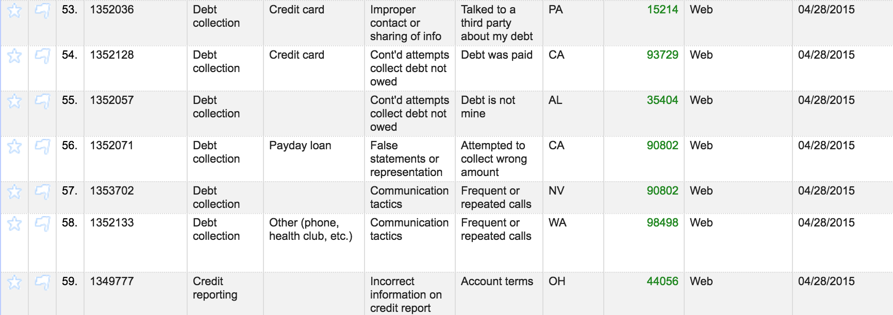

If you need to undo the operation, switch to the Undo/Redo tab. Select the previous state for the data. In this example, I went back to state 2. As you can see in this screenshot, row 151 has a missing ZIP code, indicating that the fill downs for ZIP code and State have been undone. Observe that the list in Undo/Redo may look different, if you have been issuing more or different commands than explicitly required by the lab.

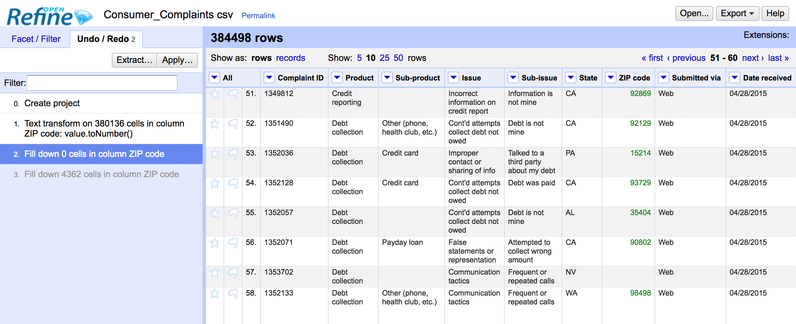

Let's create a new column called "ZipCode5", with all ZIP codes that contain five digits preserved, and all other ZIP codes set to 99999.

*(Note: technically speaking, the four-digit ZIP codes may be valid; we do this to illustrate transformations.)*

Transformations are generally expressed in some language. OpenRefine supports a few alternative languages for transform; we will be using GREL. You can find a link to a language reference in the resources section. For this simple transformation we will use an `if` statement

| Expression | Result |
|------------|--------|
| `if("international".length() > 10, "big string", "small string")` | `big string` |
| `if(mod(37, 2) == 0, "even", "odd")` | `odd` |

Return to a page of results with some four-digit ZIP codes. For the "ZIP code" column, select `Edit Column -> Add column based on this column.` The dialogue box below will open. Insert the name of the new column, and the expression:

```if(value.length() > 4, value, "99999")```

This expression states that, if the length of value is more than four, insert the value; otherwise, insert the string "99999".

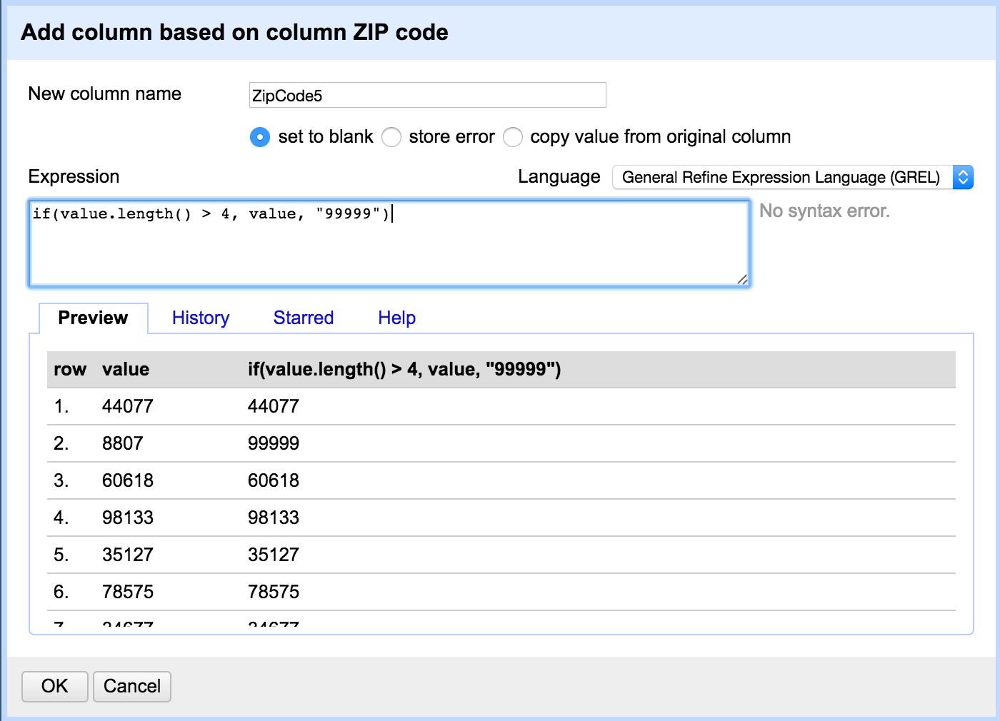

Look at the results. Did this do what you wanted? What seems to be wrong? Roll back the change, using Undo/Redo. What happens if you instead insert a numeric value, using the following expression?

```if(value.length() > 4, value, 99999)```


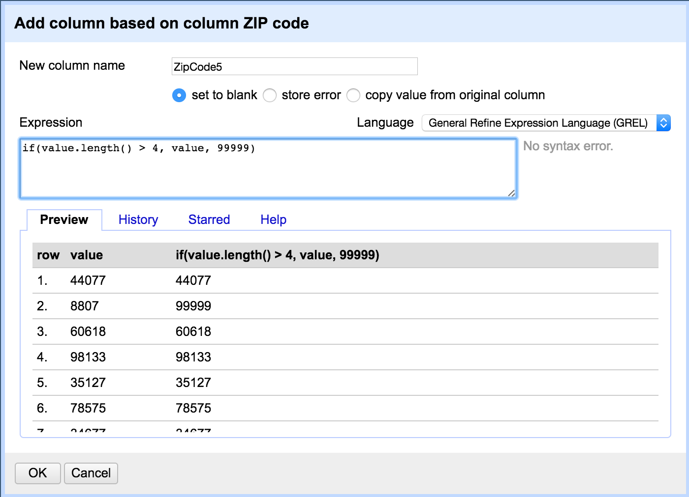

You should now have the same type for all cells in the created column. As an example, the result should look something like the following:

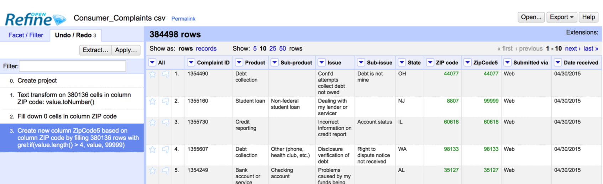

---

**SUBMISSION 3:**

*If you consider all ZIP codes less than 99999 to be valid, how many valid and invalid ZIP codes do you have, respectively?

---

## Step 2. Cleaning Up eq2015 Data

Create a project from the dataset eq2015.csv, using the same procedure as before. After you verify that the data looks OK, create the project.


As you can see, the "nst" column is missing quite a few values. Look up the nst attribute in the glossary. What would happen if we just ignored a row with missing values? Is there an obvious strategy for filling in the missing values? What would you suggest we do with the column?

Next, we want to extract an approximate area from the "place" column. We would like to have a state or country, and to store that information in a separate column, called "location."

As we review the "place" column, we notice that the cell seems to consist of two comma-separated components. The components are a distance and direction, and a general location.

Select the command:

```Edit Column -> Add Column based on this column```

You should see the following dialogue box. Type in the column name of the new column, "location."

Since we noticed that the cells have two comma-separated components, and the second is a location, we defined the following expression:

```value.split(",")[1]```

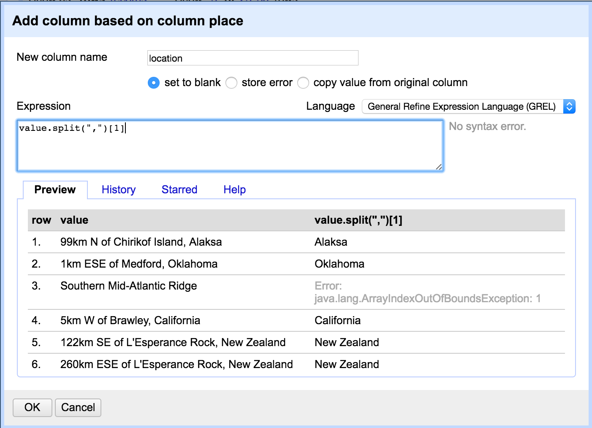


But, as you probably noticed, this did not work well. In fact, not all cells have the two components. If you look at the data more closely, it appears that if an earthquake was offshore, the location component is missing. So, we modify the expression as follows:

```if(value.split(",").length() < 2, "Offshore", value.split(",")[1])```

If a cell has only one component, we assume it is Offshore, and put that value in the "location" column.

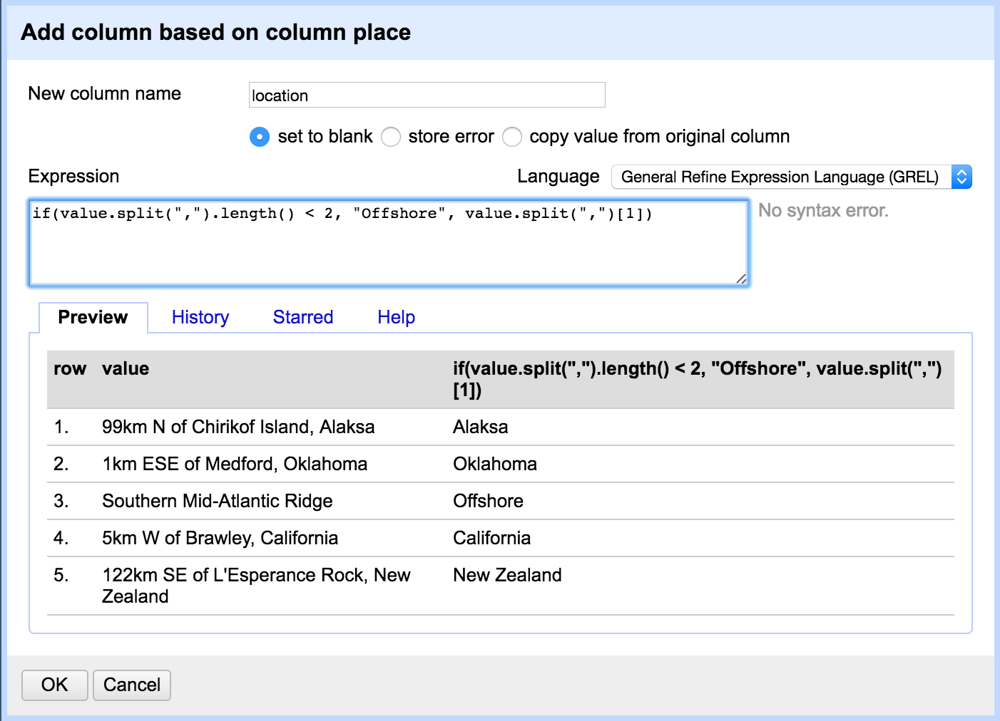

Check the resulting data. Do they seem reasonable, or are more adjustments needed?

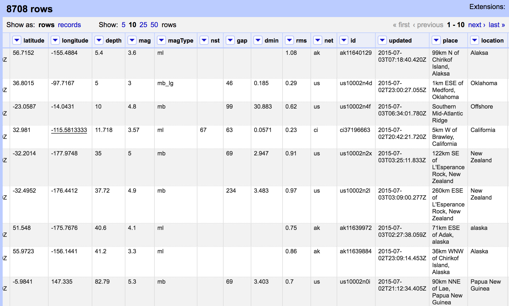

Check the value by using a text facet on the column. You may notice that there are multiple strings that look like "Alaska," but they appear to be misspelled.

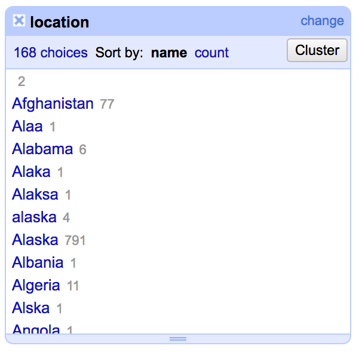

Clustering may help us detect more of these kinds of situations. Run clustering by clicking **Cluster** on the facet, or using the column pop-up menu and selecting:

```Edit Cell -> Cluster and edit```

Try key collision. What do you see? Try nearest neighbor and Levenshtein. What do you see? You can change the parameters, such as Radius and Block Chars. Radius provides a threshold for how close (in terms of distance measure) the strings should be to be considered representing the same entity. The Block Char parameter may be a little counterintuitive. Blocking defines blocks within which the string distance method is applied. It helps with scalability, because we will not compare strings across the whole dataset. The OpenRefine blocking parameter defines the size of a substring S, such that all strings that share S will be in a common block. So a smaller S will likely result in bigger blocks, and more computation required.

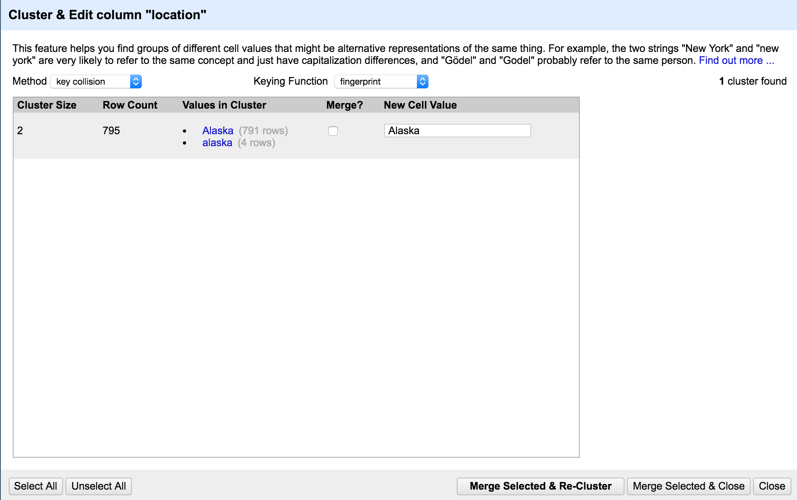

Change the radius to 2.0. What happens?

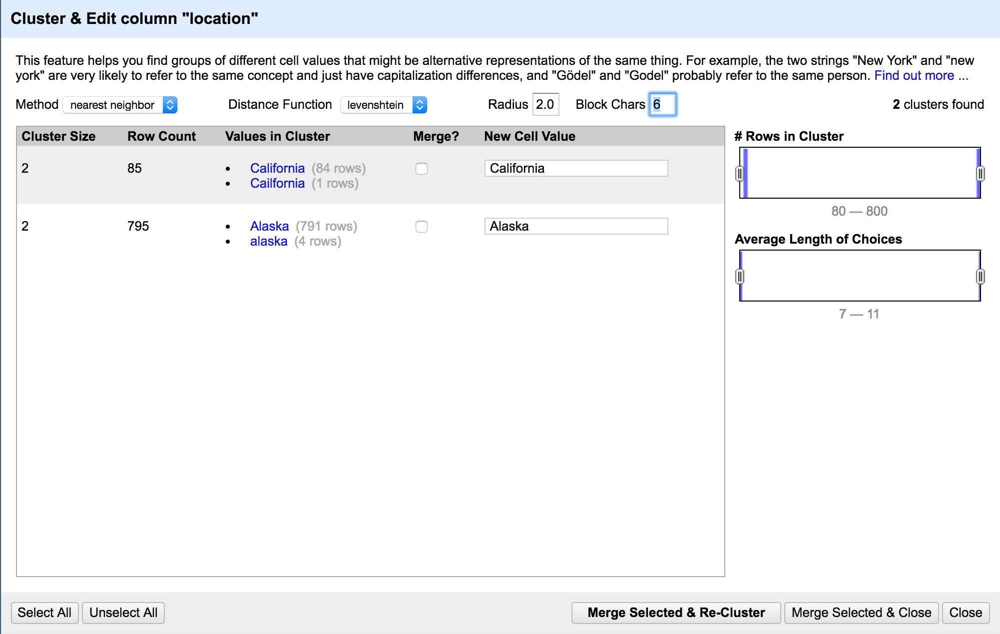

---

**SUBMISSION 4:**

*Change the radius to 3.0. What happens? Do you want to merge any of the resulting matches?*

---

---

**SUBMISSION 5:**

*Change the block size to 2. Give two examples of new clusters that may be worth merging.*

---

You can try different parameters to see if you can catch the issues you see. If not, you can also note that there are a few misspellings of "Alaska" that occur only once. Hence, it is reasonable to go in and edit by hand. Eventually you should be left with only false matches in the clustering window.

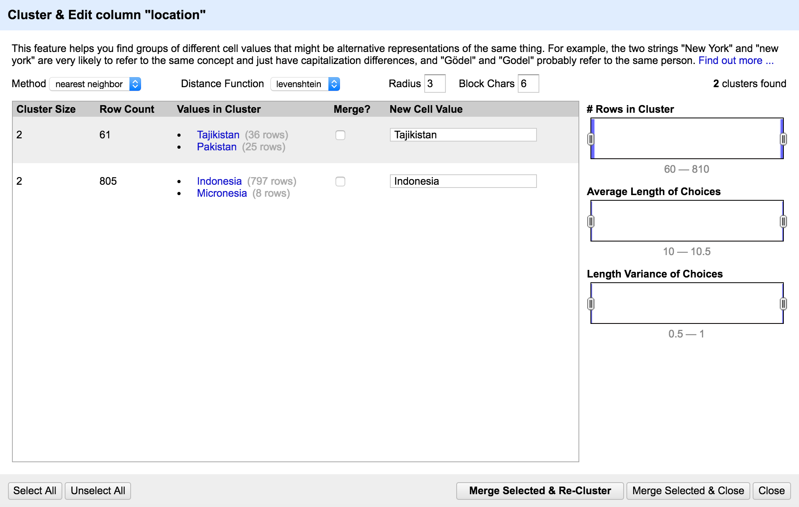

If you review the facet, you may still see values that seem wrong, but were not caught. If these are single values, the easiest fix is probably a manual edit of those cells. You can access the values by clicking on them in the facet widget. Click the `edit` button in an individual cell to fix its value.

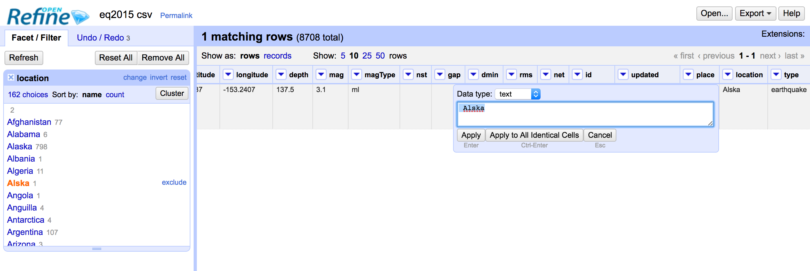

However, if you have a very large database, and you want to automate the cleaning, manual editing would not be feasible.

The "place" column strings are significantly longer than the strings for location. Try to do nearest neighbor clustering on the "place" column. What happens, and why? How does the user experience compare with the clustering of the "location" column?

---

**SUBMISSION 6:**

*Explain in words what happens when you cluster the "place" column, and why you think that happened. What additional functionality could OpenRefine provide to possibly deal with the situation?*

*Hint: you may want to cancel the run.*

---

## Step 3. Levenshtein Distance

### Introduction

In this part of the lab, we will go over a simple example of the Levenshtein distance calculation. We sill then ask you to calculate the distance for two strings: "gumbarrel" and "gunbarell." We will point you to a Python implementation of the Levenshtein distance that you can use to check your result.

### Installing the Levenshtein Python module

The Levenshtein module can be installed using pip.

```
$ pip install python-levenshtein
$ python
>>> from Levenshtein import *
>>> distance("hej","hei")
1
>>> distance("monthgomery st","montgomery street")
5
```

### Example: Levenshtein Calculation

Let's step through the calculation of distance between the words `LOYOLA` and `LAJOLLA`. We will denote a cell with `d[i,j]`, where `i` is the row, and `j` is the column. The dark column and row indicates the index number we will be using for the actual calculation matrix.

As a reminder, the algorithm is as follows:

```
Denote the rows by r and columns by c. We have n rows and m columns.
d[i,j] denotes the value on row i and column j.

cost[i,j] = 1 if c[i] != r[j]
cost[i,j] = 0 if c[i] == r[j]

d[i,j] is to be set to the minimum of:

- d[i-1,j]+1
- d[i,j-1]+1
- d[i-1,j-1]+cost[i,j]

Distance is found in the resulting value d[n,m].
```

We first set up the matrix. The bold first row and column contain the i and j values. We then insert values `0-m` in the first row (`i==1`) and `0-n` in the first column (`j==1`).

|       |   | 1 | 2 | 3 | 4 | 5 | 6 | 7 |
|-------|---|---|---|---|---|---|---|---|
|       |   |   | L | O | Y | O | L | A |
| **1** |   | 0 | 1 | 2 | 3 | 4 | 5 | 6 |
| **2** | L | 1 |   |   |   |   |   |   |
| **3** | A | 2 |   |   |   |   |   |   |
| **4** | J | 3 |   |   |   |   |   |   |
| **5** | O | 4 |   |   |   |   |   |   |
| **6** | L | 5 |   |   |   |   |   |   |
| **7** | L | 6 |   |   |   |   |   |   |
| **8** | A | 7 |   |   |   |   |   |   |

Let's calculate `d[i,2]`, the value for each row in column 2.

```
d[2,2], cost = 0, minimum is d[1,1]+0 => 0
d[3,2], cost = 1, minimum is d[2,2]+1 => 1
d[4,2], cost = 1, minimum is d[3,2]+1 => 2
d[5,2], cost = 1, minimum is d[4,2]+1 => 3
d[6,2], cost = 0, minimum is d[5,1]+0 => 4 (or d[5,2]+1)
d[7,2], cost = 0, minimum is d[6,2]+0 => 5 (or d[6,2]+1)
d[8,2], cost = 1, minimum is d[7,2]+1 => 6
```

|       |   | 1 | 2 | 3 | 4 | 5 | 6 | 7 |
|-------|---|---|---|---|---|---|---|---|
|       |   |   | L | O | Y | O | L | A |
| **1** |   | 0 | 1 | 2 | 3 | 4 | 5 | 6 |
| **2** | L | 1 | 0 |   |   |   |   |   |
| **3** | A | 2 | 1 |   |   |   |   |   |
| **4** | J | 3 | 2 |   |   |   |   |   |
| **5** | O | 4 | 3 |   |   |   |   |   |
| **6** | L | 5 | 4 |   |   |   |   |   |
| **7** | L | 6 | 5 |   |   |   |   |   |
| **8** | A | 7 | 6 |   |   |   |   |   |

Let's calculate `d[i,3]`, the value for each row in column 3.

```
d[2,3], cost = 1, minimum is d[2,2]+1 => 1
d[3,3], cost = 1, minimum is d[2,2]+1 => 1
d[4,3], cost = 1, minimum is d[3,2]+1 => 2 (or d[3,3]+1)
d[5,3], cost = 0, minimum is d[4,2]+0 => 2
d[6,3], cost = 1, minimum is d[5,3]+1 => 3
d[7,3], cost = 1, minimum is d[6,2]+1 => 4 (or d[6,3]+1)
d[8,3], cost = 1, minimum is d[7,3]+1 => 5
```

|       |   | 1 | 2 | 3 | 4 | 5 | 6 | 7 |
|-------|---|---|---|---|---|---|---|---|
|       |   |   | L | O | Y | O | L | A |
| **1** |   | 0 | 1 | 2 | 3 | 4 | 5 | 6 |
| **2** | L | 1 | 0 | 1 |   |   |   |   |
| **3** | A | 2 | 1 | 1 |   |   |   |   |
| **4** | J | 3 | 2 | 2 |   |   |   |   |
| **5** | O | 4 | 3 | 2 |   |   |   |   |
| **6** | L | 5 | 4 | 3 |   |   |   |   |
| **7** | L | 6 | 5 | 4 |   |   |   |   |
| **8** | A | 7 | 6 | 5 |   |   |   |   |

if you do the same thing for the remaining columns, you will get the following matrix. You see the calculated edit distance in cell `d[8,7]`.

|       |   | 1 | 2 | 3 | 4 | 5 | 6 | 7 |
|-------|---|---|---|---|---|---|---|---|
|       |   |   | L | O | Y | O | L | A |
| **1** |   | 0 | 1 | 2 | 3 | 4 | 5 | 6 |
| **2** | L | 1 | 0 | 1 | 2 | 3 | 4 | 5 |
| **3** | A | 2 | 1 | 1 | 2 | 3 | 4 | 4 |
| **4** | J | 3 | 2 | 2 | 2 | 3 | 4 | 5 |
| **5** | O | 4 | 3 | 2 | 3 | 2 | 3 | 4 |
| **6** | L | 5 | 4 | 3 | 3 | 3 | 2 | 3 |
| **7** | L | 6 | 5 | 4 | 4 | 4 | 3 | 3 |
| **8** | A | 7 | 6 | 5 | 5 | 5 | 4 | **3** |

If you use the Levenshtein function to check the result, you will see the following:

```
>>> distance("loyola","lajolla")
3
```

So we can trust that we performed the manual calculation correctly.

### Calculation: "gumbarrel" vs. "gunbarell"

Now calculate the edit distance between the words "gumbarrel" and "gunbarell." After you are done, use the Python Levenshtein function to check your result.

|       |   | 1 | 2 | 3 | 4 | 5 | 6 | 7 | 8 | 9 | 10 |
|-------|---|---|---|---|---|---|---|---|---|---|----|
|       |   |   | G | U | M | B | A | R | R | E | L  |
| **1** |   | 0 | 1 | 2 | 3 | 4 | 5 | 6 | 7 | 8 | 9  |
| **2** | G | 1 |   |   |   |   |   |   |   |   |    |
| **3** | U | 2 |   |   |   |   |   |   |   |   |    |
| **4** | N | 3 |   |   |   |   |   |   |   |   |    |
| **5** | B | 4 |   |   |   |   |   |   |   |   |    |
| **6** | A | 5 |   |   |   |   |   |   |   |   |    |
| **7** | R | 6 |   |   |   |   |   |   |   |   |    |
| **8** | E | 7 |   |   |   |   |   |   |   |   |    |
| **9** | L | 8 |   |   |   |   |   |   |   |   |    |
| **10** | L | 9 |   |   |   |   |   |   |   |   |    |

---

**SUBMISSION 7:**

*Submit a representation of the resulting matrix from the Levenshtein edit distance calculation. The resulting value should be correct.*

---
